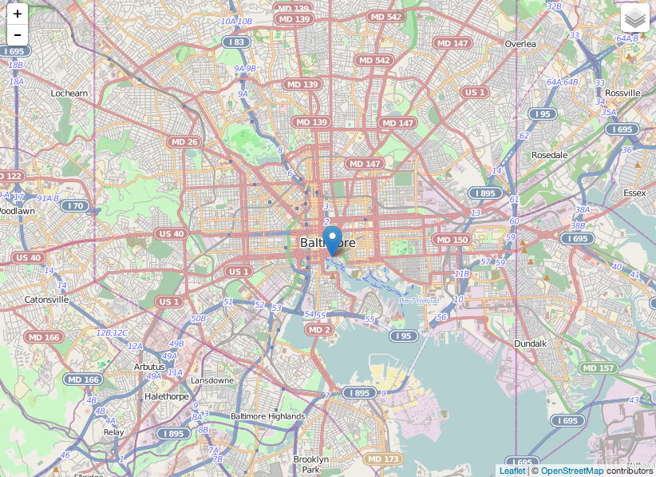

layout: true
class: middle

---

class:middle, center

# The "We're back" event!


???

---

# Who the #^!! is this ginger?
*or why you should (or should not) listen to me*

???
- Came to Baltimore 6 years ago to build websites
- Worked as a Front-End Dev and UX Designer
- Recently worked with a DC startup to help implement a custom mapping solution

---

# *Get on with it already*

---

## Three Reasons to give Leaflet a try

1. Open Source with serious backers
2. Powers [Flickr](https://www.flickr.com/map?&fLat=39.2838&fLon=-76.587&zl=17&min_upload_date=1404091663), [Foursquare](https://foursquare.com/explore?mode=url&near=Baltimore%2C%20MD), and [Pintrest](http://www.pinterest.com/baltimorebnb/cool-baltimore-stuff/).
3. Simple and easy to use [API](http://leafletjs.com/reference.html)

???
- Mapbox recently recieved $10m of funding and employs the lead developer of the project.
- Mapbox recently went full LeafletJS for their products
- You've seen it around

**Last point is what tonight is about**, hopefully I can convince you that the API is easy to use.

---

## Where Do Maps Come From?

- GIS Data -> Map Tiles (Google, OpenStreetMaps, Bing)
- Your Geo Data -> Vector Layers & Markers
- Pull it all together, client side with Google Maps, Open Layers, or **Leaflet**

???

Quick aside...into what it takes to make a map.

---

## Hello World
```javascript
var map = L.map('map', {
  center: [39.2856, -76.6090]
});

L.tileLayer('http://{s}.tile.osm.org/{z}/{x}/{y}.png'}).addTo(map);
```

???
- {s} - subdomain
- {z} - zoom level
- {x/y} - tile coords

---

# Get's you this

---



---

# And this...

---

```html
<div class="leaflet-container">
  <div class="leaflet-map-pane">
    <div class="leaflet-tile-pane">
      <div class="leaflet-layer"></div>
    </div>
    <div class="leaflet-objects-pane">
      <div class="leaflet-shadow-pane"></div>
      <div class="leaflet-overlay-pane"></div>
      <div class="leaflet-marker-pane"></div>
      <div class="leaflet-popup-pane"></div>
    </div>
  </div> <!-- leaflet-map-pane -->
  <div class="leaflet-control-container"></div>
</div>
```

---

# Make your own Markers, Icons, and Popups

---

## Markers

As simple as:
```javascript
var marker = L.marker([50.5, 30.5]);
marker.addTo(map);
```

*really just a top level object*

---

## And Events

And you got all of these events:

```javascript
click
dblclick
mousedown
mouseover
mouseout
contextmenu
dragmenu
dragstart
drag
dragend
move
add
remove
popupopen
popupclose
```

*Plus [functions to boot](http://leafletjs.com/reference.html#marker-addto).*

---

class:middle
# Icons
*AKA You don't want those blue markers*

Two options `L.Icon` and `L.divIcon`

---

## L.Icon
```javascript
// Use this if you have an image you want to use
var myIcon = L.icon({
    iconUrl: 'my-icon.png',
    iconRetinaUrl: 'my-icon@2x.png',
    iconSize: [38, 95],
    iconAnchor: [22, 94],
    popupAnchor: [-3, -76],
    shadowUrl: 'my-icon-shadow.png',
    shadowRetinaUrl: 'my-icon-shadow@2x.png',
    shadowSize: [68, 95],
    shadowAnchor: [22, 94]
});
```

---

## L.divIcon

```javascript
// Use this if you want to use CSS3 for styling it
var myIcon = L.divIcon({
  className: new_class,
  iconSize: iSize,
  iconAnchor: iAnchor,
  popupAnchor: [38,38]
});
```

---

class:middle

And then include it in when you make your marker.

```javascript
L.marker([lat, lng], {icon: myIcon}).addTo(map);
```

---

class: middle

# Popups are simple

---
```javascript
function markerClickAction (uid,lat,lng,type) {

  var k = '.'+uid, obj = $(k);

  if ( !obj.hasClass('open-leaflet') ) {

    map.panTo(new L.LatLng(lat,lng));

    $('.open_project, .open_expert').fadeOut()
      .closest('.leaflet-marker-icon')
      .removeClass('open-leaflet'); //hides open popups

    obj.addClass('open-leaflet'); //opens correct popup
    var klass = '.open_'+type;

    obj.find(klass).fadeIn().on('click', 'button.close',
    function (event) {
      $('.open_project, .open_expert').fadeOut()
        .closest('.leaflet-marker-icon')
        .removeClass('open-leaflet');
      event.stopPropagation();
      return false;
    }).on('click', 'a', function(event){
      event.stopPropagation();
    });
  }
}
```

---

## Just do this

```javascript
marker.bindPopup(popupContent);

marker.on('click', function () {
  this.openPopup();
});
```

*I was able to do this by shoving the whole popup into `L.divIcon`.* **Totally bad form.**

---

## Other things to read up on

* Methods for [modifying](http://leafletjs.com/reference.html#map-set-methods) and [getting](http://leafletjs.com/reference.html#map-get-methods) the state of the Map
* [Conversion methods](http://leafletjs.com/reference.html#map-conversion-methods) and [Transformations](http://leafletjs.com/reference.html#transformation)
* Take a look at [Controls](http://leafletjs.com/reference.html#control)
* [Vector layers](http://leafletjs.com/reference.html#path)

---

# Words of warning

1. Start with Leaflet Objects
2. Be wary of over-reliance on outside libraries
  * (jQuery &amp; Underscore)
3. There was a third one but I honestly can't remember it

---

# Leaflet Plugins, Mixins, and Extensions

They're all the same thing really. The API provides a lot of the basic building blocks for making what you need.

---

## It's got Class
JavaScript, not so much...things Leaflet will do for you:

* Proper inheritance with `extend`
* Options (see `setOptions`)
* Include mixins (e.g. L.events)
* Define Statics
* Constructor Hooks (modify other parts of Leaflet on init)

---

```javascript
var MyClass = L.Class.extend({
    initialize: function (greeter) {
        this.greeter = greeter;
        // class constructor
    },

    greet: function (name) {
        alert(this.greeter + ', ' + name)
    }
});

// create instance of MyClass, passing "Hello" to the constructor
var a = new MyClass("Hello");

// call greet method, alerting "Hello, World"
a.greet("World");
```

---

## Events

```javascript
addEventListener( <String> type, <Function> fn, <Object> context? )
addOneTimeEventListener( <String> type, <Function> fn, <Object> context? )
addEventListener( <Object> eventMap, <Object> context? )
removeEventListener( <String> type, <Function> fn?, <Object> context? )
removeEventListener( <Object> eventMap, <Object> context? )
removeEventListener()
hasEventListeners( <String> type )
fireEvent( <String> type, <Object> data? )
clearAllEventListeners()
on( … )
once( … )
off( … )
fire( … )
```

---

## Leaflet Utility Functions

Before reaching for underscore, check `L.Util`.

```javascript
L.Util.extend(destination, source);   // Leaflet
_.extend(destination, *sources);      // Underscore


L.Util.bind(functin, object);
_.bind(functin, object, *args);


L.Util.limitExecByInterval(functin, wait, [context]);
_.debounce(functin, wait, [immediate]);


L.Util.setOptions(object, options);
_.defaults(object, *defaults);


L.Util.template(templateString, data);
_.template(templateString, [data], [settings]);
```

---

# Three Examples

---

# Project Specific Mixin

---

```javascript
L.Util.VIPUtils = L.Util.extend({

  layerToJson: function (layer) {
    return jQuery.toJSON( layer.toGeoJSON() );
  },

  // Reverse geocodes an address
  reverseGeocode: function (lat, lng, callback) {
    $.ajax({
      type: 'GET',
      url: '/api/reverse_geocode',
      context: this,
      data: {
        'lat': lat,
        'lng': lng
      },
      dataType: 'json',
      success: callback,
      error: function (jqXHR, textStatus, error) {
        throw new Error('Error fetching address');
      }
    });
  }
});
```

---

# Fixed Marker Plugin
- [Local Example](http://vip-leaflet.dev/projects/americo-vespucio-oriente-urban-highway)
- [Code](fixedMarker.html)
---

# Extending Leaflet.Draw
- [Local Example](http://vip-leaflet.dev/projects/edit_fundamentals/transandino-central-railway)
- [Code](advancedMapDraw.html)

---

# Advanced Topics
Quick Backbone.js & Leaflet.js demo ??
